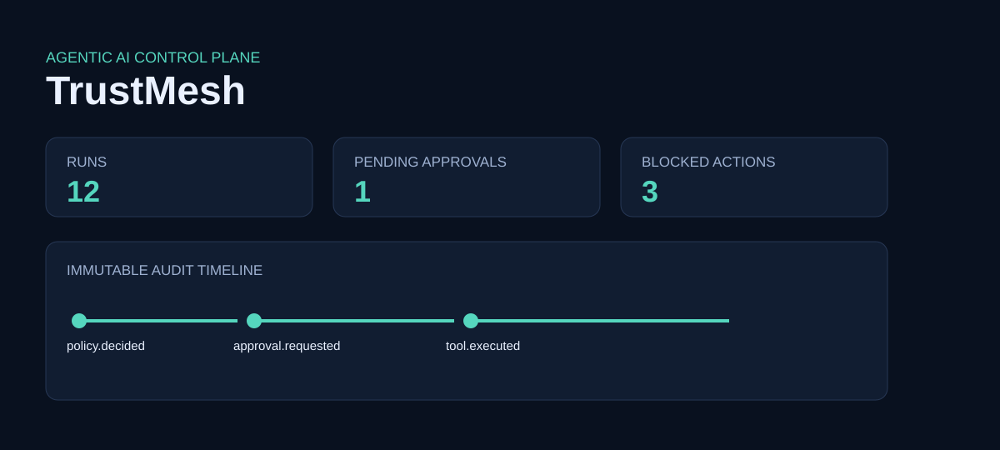
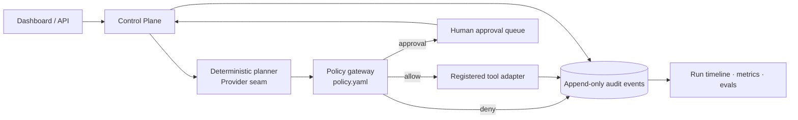

# TrustMesh

> **An EU-ready Agentic AI Control Plane and Evaluation Lab.** TrustMesh proves that an agent can be useful without being trusted blindly: every tool proposal is deterministically allowed, paused for a person, or blocked; every decision becomes an auditable event.



## 30-second recruiter view

TrustMesh is a production-shaped local MVP for Germany/EU AI engineering roles. It combines a deterministic planner, MCP-style registered tools, policy-as-code, human approvals, append-only SQLite audit events, trace IDs, structured logs, Prometheus-style metrics, and an offline evaluation harness. It runs without credentials; a model-provider boundary can replace the deterministic planner later.

## Quick start

```bash
uv sync --group dev
uv run uvicorn trustmesh.app:app --reload
# open http://localhost:8000 and http://localhost:8000/docs
```

Or run `docker compose up --build`. Copy `.env.example` to `.env` to set a persistent database path.

## Demo path

1. Submit **“Summarise the incident runbook”** — `search_knowledge` is allowed and the run completes.
2. Submit **“Send an email update”** — the read step executes, then `send_email` becomes `awaiting_approval`.
3. Approve from the queue or `POST /api/approvals/{id}/approve` — execution resumes and completes.
4. Submit **“Delete customer 42”** or an injection marker — the policy gateway blocks it before tool execution.

## Architecture



The domain (`Action`, `Decision`, `PolicyGateway`) is independent of FastAPI and persistence. `ControlPlane` orchestrates it; `EventStore` is the outbound persistence adapter. This is deliberately small hexagonal architecture rather than a framework-shaped demo.

## Actual local verification

The checked-in evaluation report is from a local execution: dataset `2026.1`, **4/4 passed (100%)**. Its cases cover safe completion, approval routing, destructive-action denial, and prompt-injection denial. See [eval report](docs/verification/eval-report.json) and [test output](docs/verification/tests.txt). Exact commands: `uv run pytest -q` and `uv run python evals/run_eval.py`.

## Email classifier evaluation (offline, staged draft)

**The problem.** Editing a prompt or its configuration for an LLM-shaped
feature can silently change output quality — a single wording or keyword
change can flip previously-correct outputs with no visible signal until
someone notices downstream. Without an automated, repeatable check, that kind
of regression ships unreviewed. This evaluator exists to make a prompt/config
change's effect on classifier output diffable before merge, entirely offline.

**Purpose.** A deterministic, fully offline regression check for the staged-draft
customer-support email classifier (`trustmesh/email_classifier.py`). It loads the
checked-in `v1` prompt config and the 16-case staged dataset, runs the async
evaluation engine, and compares category-match results against a checked-in baseline
run. It makes no model/provider call, no network request, and requires no API key,
webhook URL, or other secret/environment configuration — see
`tests/test_email_classifier_eval_reporting_offline_guardrails.py`.

**Local command:** `uv run python evals/run_email_classifier_eval.py` (or `make
eval-email-classifier`). It prints a structured pass/warn/fail headline JSON to
stdout and writes `report.json`, `report.html`, and `alert.json` to
`--output-dir` (default `eval-artifacts/email_classifier/`, not checked in). The
process exits nonzero **only** when the comparison status is `critical` — `ok` and
`warning` both exit zero, so CI can surface a regression without blocking merges
until that behavior is separately authorized.

**Dataset/provenance warning.** `evals/email_classifier_staged/v1.json` is a
**staged draft**: it was authored entirely by an AI assistant as synthetic seed
data. It is **not golden**, not human-reviewed, not BASWE-scale (16 of the
suggested 50-100 cases), and **not production evidence**. Every report and the HTML
output carry this `staged_draft` status and the full provenance statement forward
so a staged result can never be read as a golden or model-evaluated one.

**Baseline change procedure.** The checked-in baseline,
`evals/baselines/email_classifier_staged_v1.json`, is the last accepted deterministic
run of the `v1` prompt against the `v1` staged dataset. It must never be
silently overwritten by CI. To intentionally update it after a reviewed prompt or
dataset change: regenerate it locally by running the evaluator against the new
prompt/dataset, review the resulting diff (old vs. new category matches) by hand,
and commit the updated baseline file in the same PR as the prompt/dataset change so
the regression it causes (if any) is reviewed, not hidden.

**Thresholds.** `RegressionThresholds` (`trustmesh/email_classifier_eval_comparison.py`)
defaults to a **3 percentage-point warning** and an **8 percentage-point critical**
decline in overall category pass rate, mirroring the BASWE guide's suggested
defaults. These are ordinary configurable values, not hidden constants.

**Why slow drift exists.** `trustmesh/email_classifier_eval_drift.py` implements a
seven-run moving-average check as a pure function: several small declines can each
stay under the 3pp per-run warning threshold while still adding up to meaningful
degradation over time. That module is built and unit-tested, but this CLI does not
yet read or write a persisted run-history store, so slow-drift detection is not
wired into the local command's output — wiring a history store is explicit future
scope, not implemented today.

**Walkthrough.** A local, step-by-step demo script — run the evaluator, inspect
the JSON/HTML report, edit a *temporary copy* of the prompt config to induce a
regression, rerun, and confirm the alert payload stays in-memory/offline — is
in [docs/email-classifier-eval-walkthrough.md](docs/email-classifier-eval-walkthrough.md).
No recording or publication has been made from it.

## Security and governance

Policy is reviewed YAML, default-deny, scoped by registered tool, and deterministic. Input is bounded at the API; obvious injection/secret-exfiltration markers are denied; sensitive strings are redacted before audit persistence. Approval records identify the reviewer and preserve both request and resolution events. See [threat model](docs/threat-model.md), [ADR](docs/adr-001.md), and [EU AI Act readiness mapping](docs/eu-ai-act.md).

## Tradeoffs and roadmap

SQLite and a local deterministic provider make this demo reproducible, not horizontally scalable. The injection heuristic is intentionally a defense-in-depth signal, not a complete prompt-security solution. Next: OTel SDK exporter, signed/tamper-evident event digests, RBAC/OIDC, async tool workers, real MCP transport, and calibrated model/provider adapters.

## CV bullets

- Built TrustMesh, a FastAPI agentic-AI control plane with deterministic policy-as-code, human approval gates, append-only audit trails, and offline evaluation.
- Designed least-privilege tool orchestration with prompt/tool-abuse blocking, redacted structured logs, trace IDs, latency/cost accounting, and Prometheus-compatible metrics.
- Delivered reproducible local and Docker deployment, OpenAPI APIs, CI checks, and governance documentation for EU AI Act engineering readiness.
