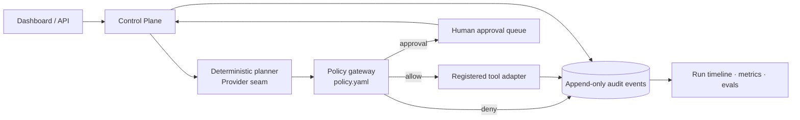

# TrustMesh

> **An EU-ready Agentic AI Control Plane and Evaluation Lab.** TrustMesh proves that an agent can be useful without being trusted blindly: every tool proposal is deterministically allowed, paused for a person, or blocked; every decision becomes an auditable event.


## 30-second recruiter view

TrustMesh is a production-shaped local MVP for Germany/EU AI engineering roles. It combines a deterministic planner, MCP-style registered tools, policy-as-code, human approvals, append-only SQLite audit events, trace IDs, structured logs, Prometheus-style metrics, and an offline evaluation harness. It runs without credentials; a model-provider boundary can replace the deterministic planner later.

## Quick start

```bash
uv sync --group dev
uv run uvicorn trustmesh.app:app --reload
# open http://localhost:8000 and http://localhost:8000/docs
```

Or run `docker compose up --build`. Copy `.env.example` to `.env` to set a persistent database path.

## Demo path

1. Submit **“Summarise the incident runbook”** — `search_knowledge` is allowed and the run completes.
2. Submit **“Send an email update”** — the read step executes, then `send_email` becomes `awaiting_approval`.
3. Approve from the queue or `POST /api/approvals/{id}/approve` — execution resumes and completes.
4. Submit **“Delete customer 42”** or an injection marker — the policy gateway blocks it before tool execution.

## Architecture



The domain (`Action`, `Decision`, `PolicyGateway`) is independent of FastAPI and persistence. `ControlPlane` orchestrates it; `EventStore` is the outbound persistence adapter. This is deliberately small hexagonal architecture rather than a framework-shaped demo.

## Actual local verification

The checked-in evaluation report is from a local execution: dataset `2026.1`, **4/4 passed (100%)**. Its cases cover safe completion, approval routing, destructive-action denial, and prompt-injection denial. See [eval report](docs/verification/eval-report.json) and [test output](docs/verification/tests.txt). Exact commands: `uv run pytest -q` and `uv run python evals/run_eval.py`.

## Security and governance

Policy is reviewed YAML, default-deny, scoped by registered tool, and deterministic. Input is bounded at the API; obvious injection/secret-exfiltration markers are denied; sensitive strings are redacted before audit persistence. Approval records identify the reviewer and preserve both request and resolution events. See [threat model](docs/threat-model.md), [ADR](docs/adr-001.md), and [EU AI Act readiness mapping](docs/eu-ai-act.md).

## Tradeoffs and roadmap

SQLite and a local deterministic provider make this demo reproducible, not horizontally scalable. The injection heuristic is intentionally a defense-in-depth signal, not a complete prompt-security solution. Next: OTel SDK exporter, signed/tamper-evident event digests, RBAC/OIDC, async tool workers, real MCP transport, and calibrated model/provider adapters.

## CV bullets

- Built TrustMesh, a FastAPI agentic-AI control plane with deterministic policy-as-code, human approval gates, append-only audit trails, and offline evaluation.
- Designed least-privilege tool orchestration with prompt/tool-abuse blocking, redacted structured logs, trace IDs, latency/cost accounting, and Prometheus-compatible metrics.
- Delivered reproducible local and Docker deployment, OpenAPI APIs, CI checks, and governance documentation for EU AI Act engineering readiness.
